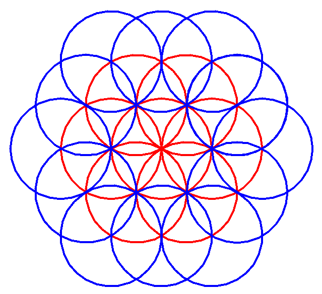

This repository containes some interesting math patterns:

1. **Flower of Life**: This is two folds flower of design symmmetry.You can find the implementation [here](flower-of-life/flower_of_life.py).

    To run the code

    ```
    $ pip install -r requirements.txt
    $ python flower-of-life/flower_of_life.py
    ```
    

2. **The Chaos Game**: A preety triangular pattern formed with jus initial input off three points and iterative mid-points calculations. The implementation can be found here.

    
